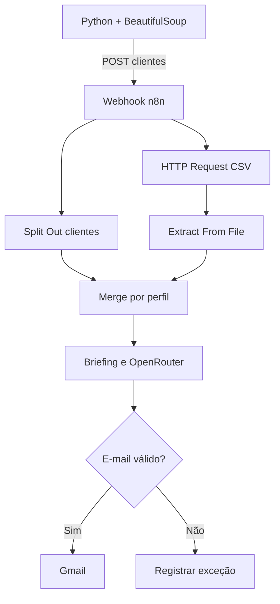

# DIO Santander — Assistente de Investimentos com RPA, n8n e IA

[](https://www.dio.me/)
[](https://n8n.io/)
[](https://www.python.org/)
[](https://openrouter.ai/)
[](#status-do-projeto)
[](./.github/workflows/tests.yml)

Projeto do desafio **Criando um Processo de RPA com N8N e Python**, do bootcamp **Santander 2026 — Automação com N8N** da DIO.

Pipeline educacional de automação que combina **RPA em Python**, **orquestração no n8n**, **personalização com IA via OpenRouter** e **envio controlado por Gmail OAuth2**.

O Python usa BeautifulSoup para extrair clientes de uma página HTML e envia o lote por webhook. O n8n consulta um catálogo CSV, normaliza e cruza os dados por perfil, prepara uma comunicação financeira responsável, valida os endereços e separa contatos inválidos antes do envio.

> Projeto educacional com dados fictícios. Rentabilidade passada ou estimada não garante resultado. Não constitui recomendação de investimento.

## Visão geral

| Camada | Tecnologia | Responsabilidade |
| --- | --- | --- |
| Extração | Python + BeautifulSoup | Ler e estruturar os clientes da página HTML |
| Integração | Requests + Webhook | Entregar o lote ao n8n por HTTP POST |
| Orquestração | n8n Self-Hosted + Docker | Coordenar transformação, cruzamento e rotas |
| Dados | CSV + Extract From File | Fornecer o catálogo fictício de investimentos |
| Inteligência artificial | OpenRouter + GPT-4o mini | Personalizar o conteúdo educativo em HTML |
| Validação | IF + regex | Impedir o envio para formatos inválidos |
| Comunicação | Gmail OAuth2 | Realizar envio autorizado e controlado |

## Capacidades demonstradas

- RPA em Python com `requests` e `BeautifulSoup`;
- webhook `POST /clientes` com resposta controlada;
- CSV lido por **HTTP Request** e **Extract From File**;
- **Split Out** para individualizar clientes;
- **Merge (Combine by Fields)** para cruzar o perfil;
- mensagem-base com **Edit Fields**;
- personalização responsável por IA usando **OpenRouter** via HTTP Request;
- campos `to`, `subject` e `html` preparados para Gmail;
- validação por regex com **IF** e rota de exceções.

## Arquitetura da solução



## Fluxo de dados

1. O RPA extrai os registros fictícios de `data/clientes.html`.
2. O lote é enviado ao webhook do n8n.
3. **Split Out** transforma a lista em itens individuais.
4. O catálogo CSV é obtido por HTTP e convertido em itens.
5. **Merge** combina cliente e produto pelo campo `perfil`.
6. O briefing aplica regras contra promessas de ganhos e dados inventados.
7. O OpenRouter retorna somente HTML simples.
8. O IF valida o endereço de e-mail e separa exceções.
9. O Gmail envia somente registros autorizados durante testes controlados.

## Como executar localmente

1. Instale as dependências:

   ```bash
   python -m venv .venv
   # Linux/macOS
   source .venv/bin/activate

   # Windows PowerShell
   .venv\Scripts\Activate.ps1

   pip install -r requirements.txt
   ```

2. Publique `data/investimentos.csv` em uma URL acessível pelo n8n. Para teste local: `python -m http.server 8080`.
3. Importe `workflow/investment-assistant-rpa.json`.
4. Ajuste a URL do nó **Buscar Catalogo de Investimentos**.
5. Crie no n8n uma credencial **Header Auth** para o OpenRouter:
   - nome do header: `Authorization`;
   - valor: `Bearer SUA_CHAVE_OPENROUTER`.
6. Crie uma credencial **Gmail OAuth2** e selecione as duas credenciais nos respectivos nós.
7. Por segurança, o nó **Enviar Email com Gmail** vem desativado na versão pública. Durante os testes, use somente um endereço real autorizado; os endereços `@example.com` da demonstração são fictícios.
8. No Webhook, clique em **Listen for test event** e copie a Test URL.
9. Execute:

   ```bash
   python rpa/extract_clients.py --webhook-url "COLE_A_TEST_URL_AQUI"
   ```

10. Confira a execução antes de ativar a Production URL.

### Ambiente local usado no projeto

- n8n Self-Hosted em Docker;
- Python para a etapa de RPA;
- servidor HTTP local iniciado na raiz do projeto com `python -m http.server 8080`;
- catálogo acessado pelo contêiner em `http://host.docker.internal:8080/data/investimentos.csv`;
- OpenRouter em `https://openrouter.ai/api/v1/chat/completions`;
- Gmail OAuth2 para o teste controlado de envio.

### Adaptação técnica: nó de IA para HTTP Request

Durante a implementação, a etapa de personalização inicialmente planejada com um nó nativo de IA foi substituída por um **HTTP Request** direcionado à API do OpenRouter. No ambiente n8n Self-Hosted utilizado no projeto, a configuração anterior não concluiu a execução de forma estável, enquanto a chamada HTTP permitiu validar diretamente o endpoint, o modelo, o corpo JSON e a resposta retornada.

A alteração não modificou o objetivo funcional do desafio: a IA continua responsável por personalizar cada mensagem a partir do perfil e do produto associados ao cliente. A adaptação apenas mudou a forma de integração e trouxe benefícios adicionais:

- compatibilidade com o ambiente local executado em Docker;
- reutilização segura da credencial Header Auth do OpenRouter;
- controle explícito do modelo, da temperatura e das mensagens enviadas;
- maior transparência para diagnóstico, testes e documentação;
- independência de uma credencial direta do provedor OpenAI.

O workflow público mantém essa decisão visível no nó **Personalizar Email com OpenRouter**, facilitando a avaliação técnica e a reprodução do projeto.

## Regras de negócio e IA responsável

- cliente e produto são associados pelo campo `perfil`;
- o texto não promete ganhos;
- somente `to` válido segue ao Gmail;
- contatos inválidos seguem para uma rota separada;
- a mensagem-base mantém o MVP funcional mesmo sem IA.

O prompt também orienta o modelo a não garantir resultados, não inventar taxas ou benefícios, não ordenar que o cliente invista e apresentar o material exclusivamente como conteúdo educativo.

## Status do projeto

| Componente | Status |
| --- | :---: |
| Extração RPA com BeautifulSoup | ✅ Validado |
| Recebimento pelo webhook | ✅ Validado |
| Leitura e transformação do CSV | ✅ Validado |
| Cruzamento de perfis | ✅ Validado |
| Personalização pelo OpenRouter | ✅ Validado |
| Validação de e-mail | ✅ Validado |
| Gmail OAuth2 | ✅ Validado com envio controlado |
| Sanitização para portfólio público | ✅ Concluída |

## Evidências para a entrega

- RPA extraindo clientes e recebendo HTTP 200;
- execução completa do workflow;
- Merge com cliente e investimento no mesmo item;
- rotas verdadeira e falsa do IF;
- vídeo curto do processo de ponta a ponta;
- JSON exportado e decisões técnicas documentadas.

## Estrutura do repositório

```text
.
├── .github/workflows/
│   └── tests.yml
├── data/
│   ├── clientes.html
│   └── investimentos.csv
├── docs/
│   └── architecture.md
├── rpa/
│   └── extract_clients.py
├── tests/
│   └── test_extract_clients.py
├── workflow/
│   └── investment-assistant-rpa.json
├── .env.example
├── CONTRIBUTING.md
├── LICENSE
├── README.md
├── requirements.txt
└── SECURITY.md
```

## Segurança

Nenhuma credencial é versionada. O workflow público não contém IDs de credenciais, tokens, chaves de API, Client ID, Client Secret ou identificadores da instância local. Uso real exige consentimento, política de retenção, revisão jurídica e humana, além de limites de envio.

Ao importar o workflow, cada pessoa deve criar e selecionar suas próprias credenciais. O nó Gmail permanece desativado até que o responsável confirme os destinatários e autorize o disparo.

## Atribuição educacional

Este projeto foi desenvolvido como entrega do desafio **Criando um Processo de RPA com N8N e Python**, do bootcamp **Santander 2026 — Automação com n8n**, disponibilizado pela DIO. A implementação, as adaptações técnicas, a documentação, os testes e a organização do repositório compõem meu trabalho de portfólio.

## Autor

**Diego Rafael Leao Garcia**  
Automation and AI Engineering student focused on n8n, Python, APIs, Docker and applied artificial intelligence.

## Aviso

Este é um projeto educacional independente. Não representa recomendação financeira, produto de investimento, consultoria profissional ou aplicação oficial da DIO, do Santander, do n8n, do OpenRouter ou do Google.
